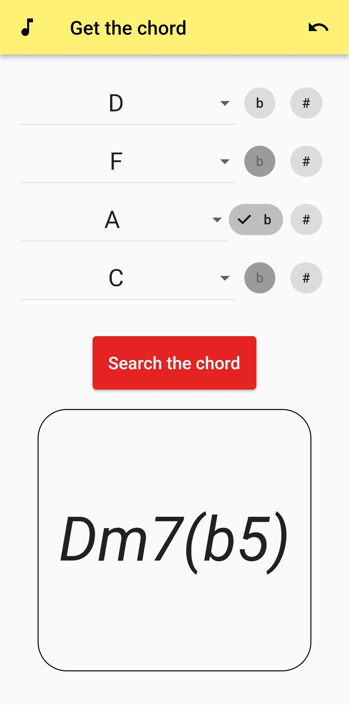
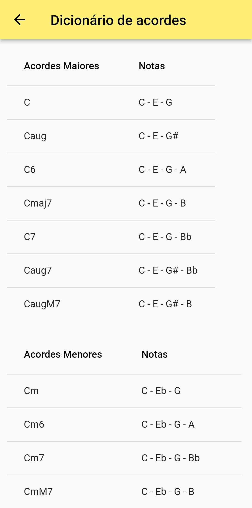

# Get the Chord App 
Aplicação em Flutter desenvolvida para plataforma Android implementando o algoritmo desenvolvido em [get_the_chord](https://github.com/crispim1411/get_the_chord).

## Objetivo

Quando se está lendo uma partitura, por exemplo, é possível identificar as notas mas nem sempre entender o acorde resultante rapidamente. Com intuito de exercitar a programação de aplicativos foi então desenvolvido este projeto tendo como base o algoritmo escrito em Rust.

## Aplicativo

 
 

## Considerações 

- Ainda necessário expandir para acordes invertidos e acordes extendidos
- A experiẽncia com Dart não tem sido das melhores